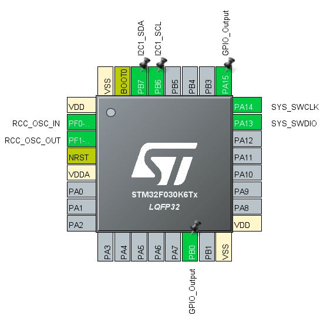
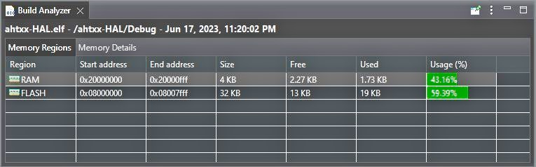
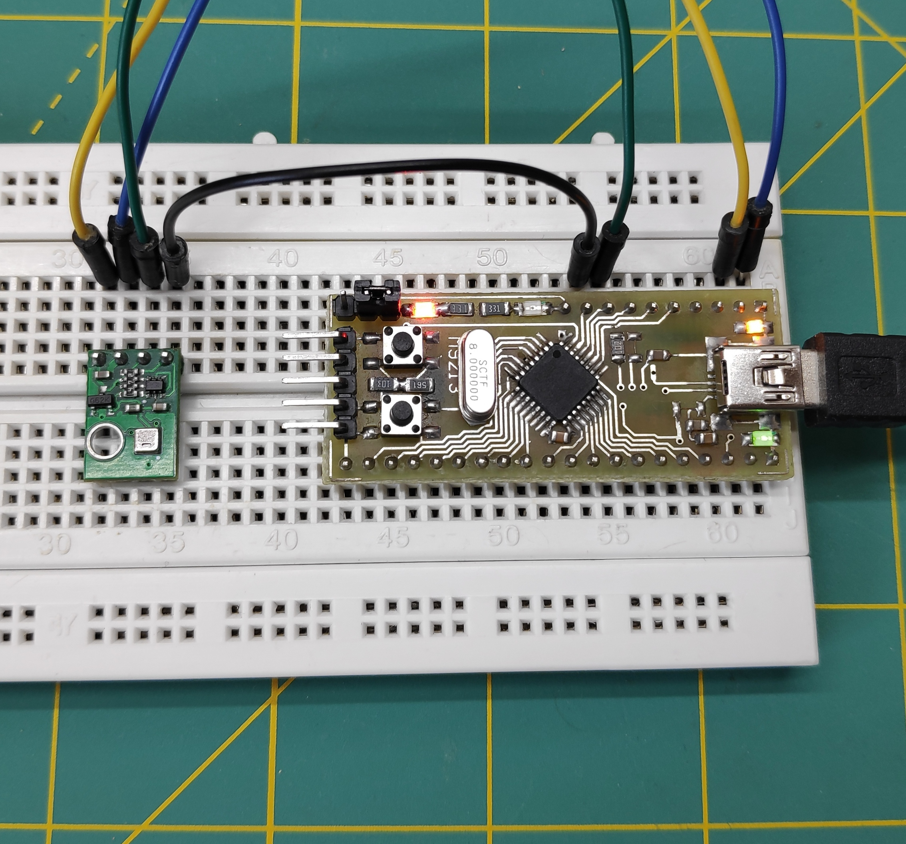
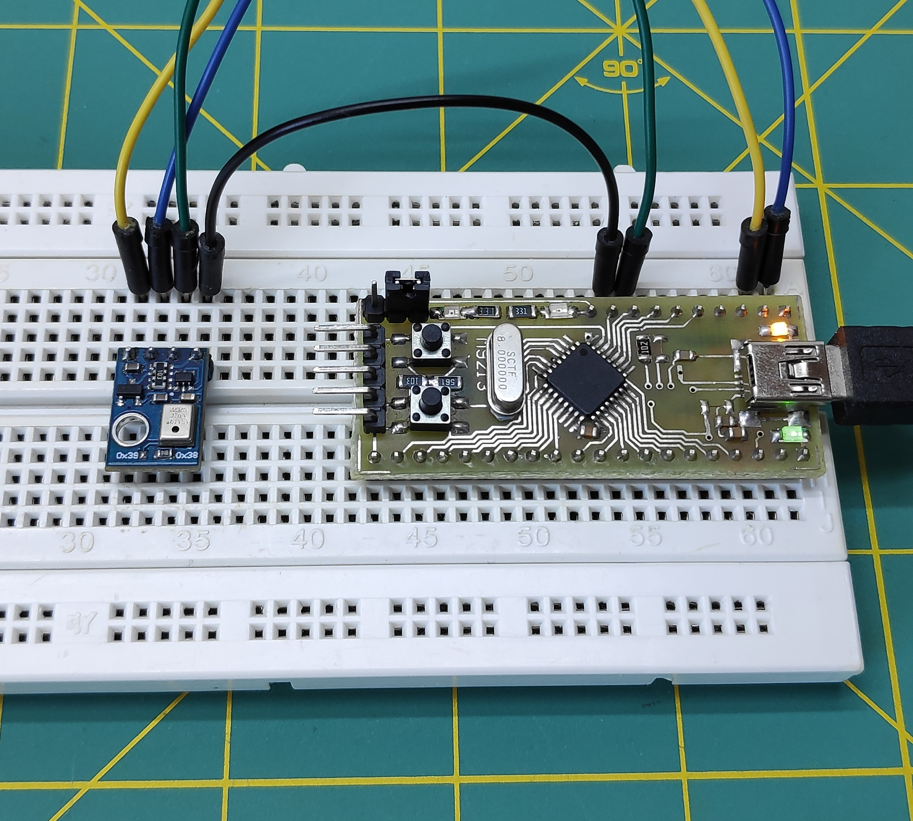
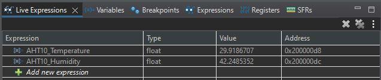

## stm32f0-ahtxx-HAL-Driver
In this project, a temperature and humidity sensor, AHT10/AHT20, is interfaced with an STM32F03K6T6 microcontroller using the HAL Driver.

1-In the `CubeIDE`, go to the **file >new >stm32 project**. Create a new project with a custom name and select your desired microcontroller. Configure the microcontroller peripherals as shown in the image below:

Configure the microcontroller peripherals

2-open `main.c` file and go to the **project >Build All**. after the build is Finished,you can view the Build Analyzer window, which shows the code size and the amount of RAM and flash memory used, as well as the available space.It appears similar to the image below:

Build Analyzer window

3-place your `AHT10` or `AHT20` module on the breadboard as shown in the images below and connect it to your headerboard:

place AHT20 module on the breadboard

place AHT10 module on the breadboard

4-If you have followed the previous steps correctly, at this stage, go to **run >Debug** and waiting until you enter the `debug` mode. After that, you will be able to see the `Live Expressions` window as shown in the image below

Live Expressions window

In the "**Expression**" section, you can enter the names of the variables where the temperature and humidity values are stored in your program, and observe the temperature and humidity values in real-time.

